**Abstract**

\[1\] An early and accurate diagnosis of Alzheimer\'s disease (AD) and
it's stages is crucial for patient treatment and care, so that patients
can take precautionary actions before irreversible brain damage develops
since they are aware of the severity and progression risks.

The role of structural brain Magnetic Resonance Imaging (MRI) is
becoming more and more emphasized in the early diagnostics of
Alzheimer\'s disease (AD).

In this study, we design a Deep Learning architecture, which contains
CNN-SVM hybrid model for detection of Alzheimer\'s disease (AD) as a
base model and another CNN-SVM hybrid model is trained with the freezed
base model in parallel, stacked over a softmax output layer, to overcome
the bottleneck in classification and aid the diagnosis of Alzheimer\'s
disease (AD) and its prodromal stage, Mild Cognitive Impairment (MCI).

**Alzheimer's Disease**

\[2\] Alzheimer's Disease affects people in a numerous way. Patients
suffer from memory loss, confusion, difficulty in speaking, reading or
writing. Eventually, they may forget about their life and could not
recognize even their family members. They can forget how to perform
daily activities such as brushing teeth or combing hair.

As a result, it makes people anxious or aggressive or to wander away
from home. Alzheimer's Disease can even cause death in elder people.

There are three major stages in Alzheimer's Disease - very mild, mild
and moderate. Detection of Alzheimer's Disease (AD) is still not
accurate until the patient reaches a moderate AD. But early detection
and classification of AD are critical for proper treatment and
preventing brain tissue damage.

Several things are needed for proper medical assessment of AD. Physical
and neurobiological exams, Mini-Mental State Examination (MMSE), and
patient's detailed history are required for accurate AD detection and
classification.

In recent years, doctors are using brain Magnetic Resonance Imaging
(MRI) data for earlier detection of Alzheimer's Disease.

**Problem Statement**

To classify the MRI images into 4 stages of Mild Cognitive Impairment
(MCI) i.e. Very Mild Demented, Mild Demented, Moderate Demented and Non
Demented

**Alzheimer's Disease MRI Images Dataset**

\[3\] In recent years, doctors are using brain Magnetic Resonance
Imaging (MRI) data for earlier detection of Alzheimer's Disease.

In this study we are using two datasets of MRI Images :-

- Dataset_AD - contains 2 classes of images, positive and negative
  > which depicts if the person has Alzhemer's Disease or not.

```
- Positive Class **→** 5932 images

- Negative Class → 5760 images
```

> 

- Dataset_AD_stages - contains 2 partition train and test which
  > further contains 4 classes of images i.e. Very Mild Demented, Mild
  > Demented, Moderate Demented and Non Demented which depicts the
  > stages of Mild Cognitive Impairment (MCI).

> Train dataset:

- Very Mild Demented → 4032 images

- Mild Demented → 1613 images

- Moderate Demented → 116 images

- Non Demented → 5760 images

> Test dataset:

- Very Mild Demented → 448 images

- Mild Demented → 179 images

- Moderate Demented → 12 images

- Non Demented → 640
  > images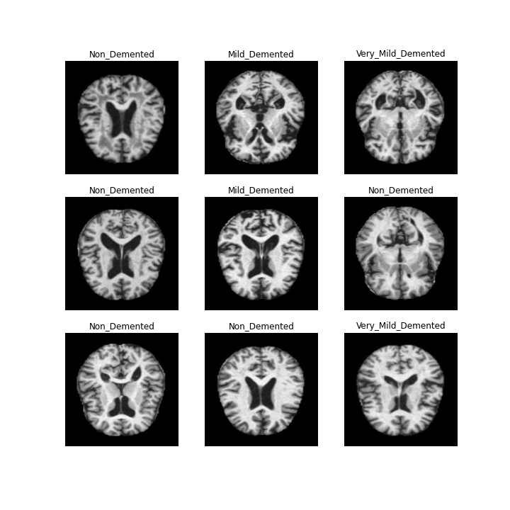

**Alzheimer's Disease Detection Model (Base Model)**

In this we use **CNN-SVM hybrid model** as the base model to detect if
the person has Alzheimer's or not. This model is trained on the
**Dataset_AD** dataset mentioned in the previous section.

**Architecture of the Model -**

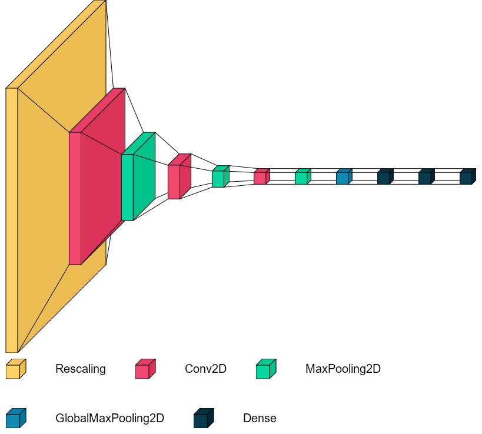

**model.summary() →**

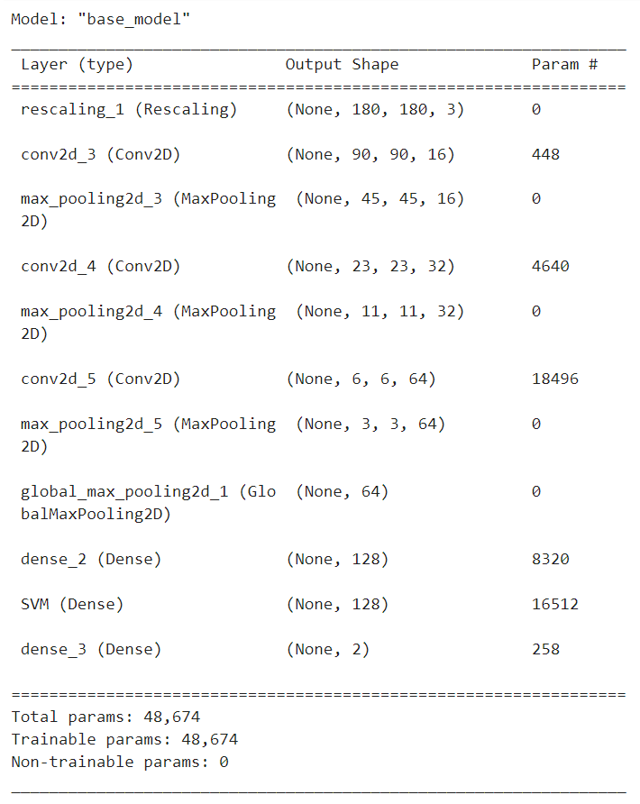

**Model training →**

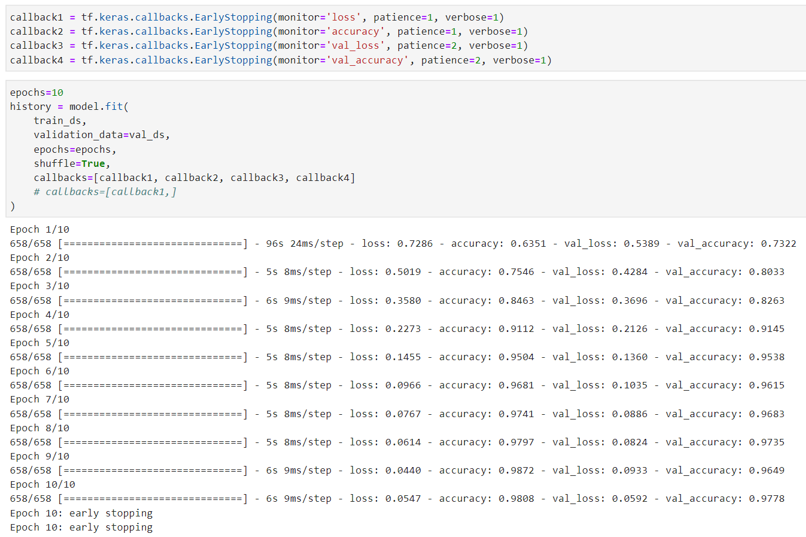

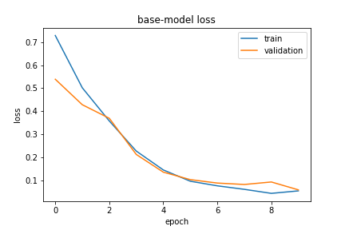
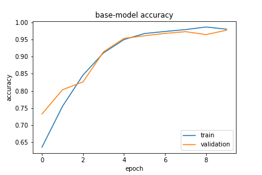

**Alzheimer's Disease Stages Detection Model (Final Model)**

In this we use **CNN-SVM hybrid model** and train in parallel to the
**freezed base CNN-SVM model** to detect the stages of Alzheimer's
Disease which the patient has in early stages of diagnosis. This is then
concatenated and passed on to a softmax output layer. This model is
trained on the **Dataset_AD_stages** dataset, mentioned in the previous
section.

**Architecture of the Model -**

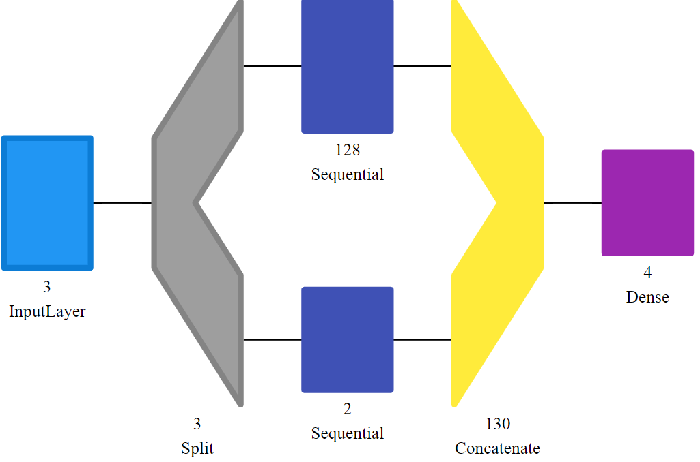

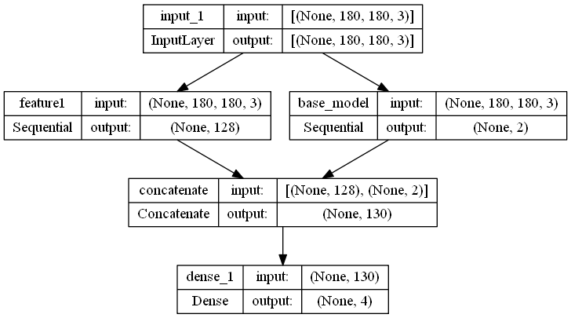

The architecture of **feature1 Sequential layer** is the **same as the
base model** **without the softmax output layer**.

**model.summary() →**

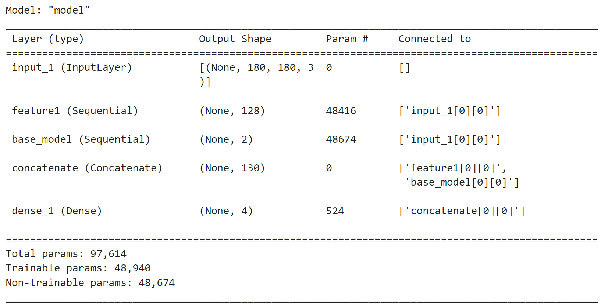

**Model training →**

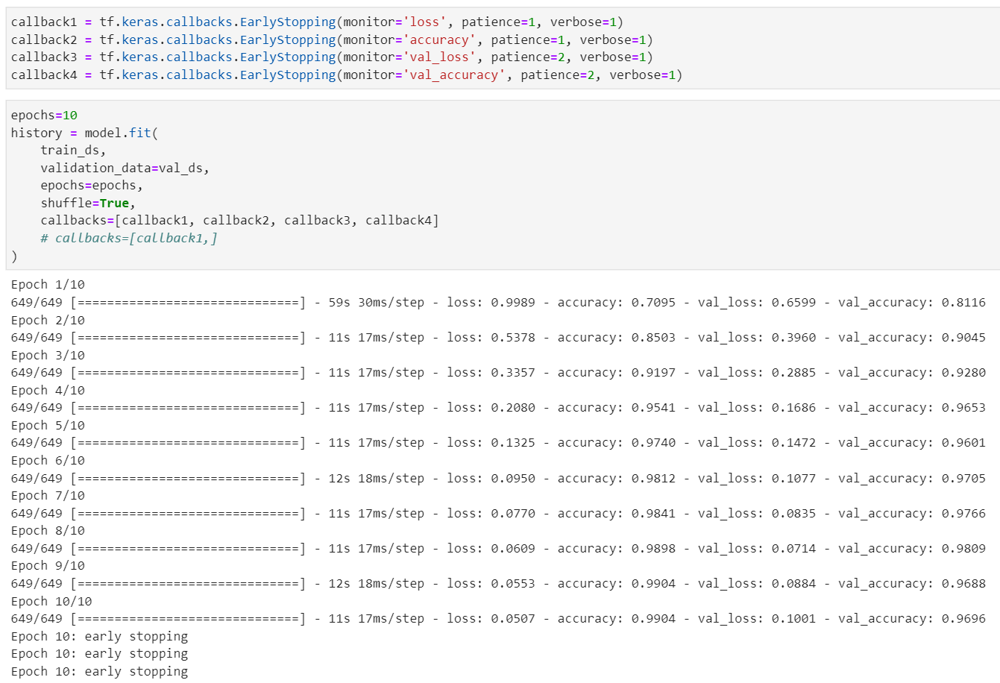

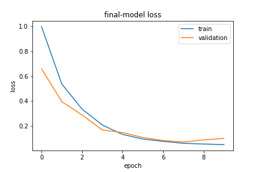
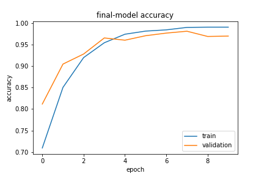

**Performance Metrics to determine the models performance**

**Base Model →**

- Confusion matrix -

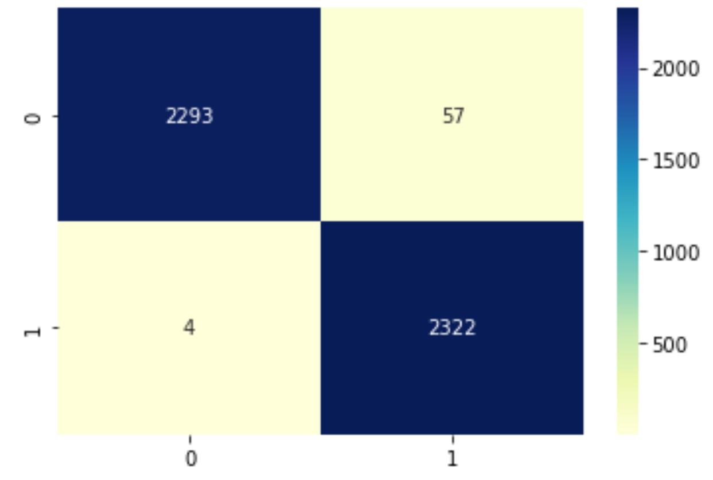

> 0 → Negative
>
> 1 → Positive

- Classification Report -

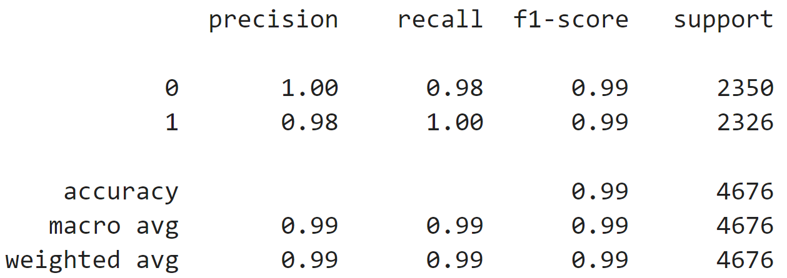

**Final Model →**

- Confusion matrix -

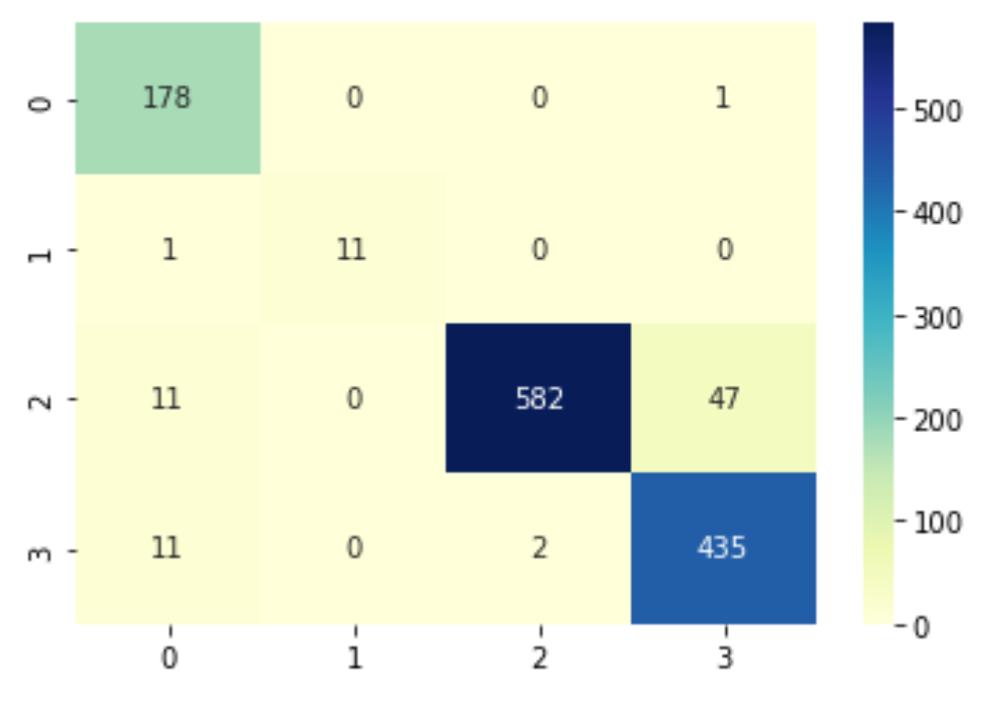

> 0 → Mild Demented
>
> 1 → Moderate Demented
>
> 2 → Non Demented
>
> 3 → Very Mild Demented

- Classification Report -

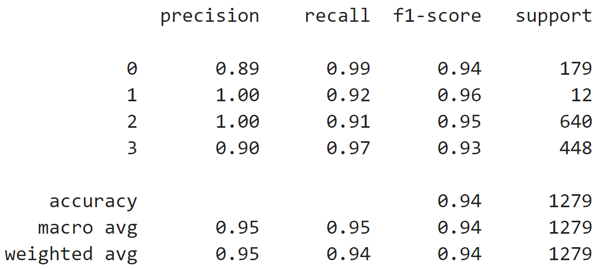

**References**

\[1\] S. Liu, S. Liu, W. Cai, S. Pujol, R. Kikinis, and D. Feng, "Early
diagnosis of Alzheimer's disease with deep learning," 2014 IEEE 11th
International Symposium on Biomedical Imaging (ISBI). IEEE, Apr-2014.

\[2\] J. Islam and Y. Zhang, "A Novel Deep Learning Based Multi-class
Classification Method for Alzheimer's Disease Detection Using Brain MRI
Data," Brain Informatics. Springer International Publishing, pp.
213--222, 2017.

\[3\] R. Wolz, V. Julkunen, J. Koikkalainen, E. Niskanen, D. P. Zhang,
D. Rueckert, H. Soininen, and J. Lötjönen, "Multi-Method Analysis of MRI
Images in Early Diagnostics of Alzheimer's Disease," PLoS ONE, vol. 6,
no. 10. Public Library of Science (PLoS), p. e25446, 13-Oct-2011.

\[4\] F. Li, D. Cheng and M. Liu, \"Alzheimer\'s disease classification
based on combination of multi-model convolutional networks,\" 2017 IEEE
International Conference on Imaging Systems and Techniques (IST), 2017,
pp. 1-5, doi: 10.1109/IST.2017.8261566.

\[5\] P. M. Krishnammal and S. S. Raja, \"Convolutional Neural Network
based Image Classification and Detection of Abnormalities in MRI Brain
Images,\" 2019 International Conference on Communication and Signal
Processing (ICCSP), 2019, pp. 0548-0553, doi:
10.1109/ICCSP.2019.8697915.
